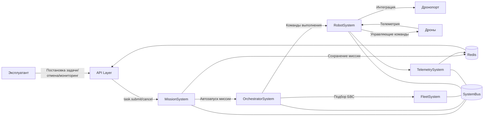

# Итоговая архитектура Наземной управляющей станции (НУС)

## 1. Общая характеристика архитектуры

Архитектура НУС построена по модульному сервис-ориентированному принципу с использованием внутренней шины сообщений (`SystemBus`). Компоненты системы взаимодействуют посредством маршрутизации сообщений по `topic` и `action`.

Система поддерживает:
- синхронные запросы (`request/response`);
- асинхронную публикацию событий (`publish`).

Формирование групп БВС осуществляется автоматически внутри НУС на основании параметров миссии и текущего состояния флота.

## 2. Внешние системы

- **Эксплуатант** — взаимодействует с НУС (постановка задачи верхнего уровня, отмена, мониторинг). Эксплуатант не управляет группами дронов напрямую.
- **Дронопорт** — система автоматизированного хранения, зарядки и подготовки БВС к выполнению миссий.
- **Дроны (БВС)** — выполняют миссии, передают телеметрию и получают команды управления.

## 3. Внутренние компоненты НУС

- **SystemBus** — маршрутизирует сообщения между компонентами по `topic` и `action`.
- **MissionSystem** — формирование миссии из задачи, импорт WPL, отмена, статусы.
- **OrchestratorSystem** — координация выполнения миссий, определение необходимого количества БВС.
- **FleetSystem** — сервис управления ресурсами флота; автоматически подбирает доступные дроны для выполнения миссии.
- **RobotSystem** — взаимодействие с БВС и Дронопортом, отправка команд и получение телеметрии.
- **TelemetrySystem** — обработка и хранение телеметрии, обновление состояния дронов.
- **Redis** — централизованное хранилище состояния (миссии, статус флота, телеметрия).

## 4. Основные потоки взаимодействия

- **Постановка задачи:** Эксплуатант → API Layer → MissionSystem.
- **Автосоздание и автозапуск миссии:** MissionSystem → Redis → OrchestratorSystem.
- **Формирование группы:** OrchestratorSystem → FleetSystem (подбор доступных БВС).
- **Выполнение миссии:** OrchestratorSystem → RobotSystem → Дроны.
- **Отмена миссии:** Эксплуатант → MissionSystem → OrchestratorSystem → RobotSystem → Дроны.
- **Мониторинг:** Дроны → RobotSystem → TelemetrySystem → Redis → API Layer → Эксплуатант.

## 5. Архитектурные особенности

Архитектура НУС обеспечивает слабую связанность компонентов за счёт использования внутренней шины сообщений. Эксплуатант формирует только задачу верхнего уровня, а распределение ресурсов и формирование группы БВС осуществляется автоматически внутри системы.

Это повышает автономность, масштабируемость и отказоустойчивость НУС.

## 6. Схема взаимодействия



## 7. Команды и события SystemBus

### 7.1 Единый формат сообщения (envelope)

```json
{
	"message_id": "uuid",
	"timestamp": "ISO8601",
	"correlation_id": "uuid",
	"source": "MissionSystem",
	"target": "OrchestratorSystem",
	"topic": "mission",
	"action": "start",
	"type": "command | event | query | response",
	"payload": {}
}
```

- `correlation_id` используется для связывания request/response.
- `topic` задаёт логическую область.
- `action` задаёт конкретное действие внутри области.

### 7.2 MissionSystem

**Commands**
- `task.submit` (`topic=task`, `action=submit`)  
	`source`: `API Layer` · `target`: `MissionSystem` · `pattern`: `one-way command`
- `mission.cancel` (`topic=mission`, `action=cancel`)  
	`source`: `API Layer` · `target`: `MissionSystem` · `pattern`: `one-way command`

**Events**
- `mission.created`
- `mission.started`
- `mission.cancelled`
- `mission.completed`
- `mission.failed`

### 7.3 OrchestratorSystem

**Commands**
- `orchestrator.plan` — расчёт необходимых ресурсов  
	`source`: `MissionSystem` · `target`: `OrchestratorSystem` · `pattern`: `query (ожидается response: orchestrator.plan.result)`
- `orchestrator.execute` — старт выполнения миссии  
	`source`: `MissionSystem` · `target`: `OrchestratorSystem` · `pattern`: `one-way command`

**Responses**
- `orchestrator.plan.result`

**Events**
- `orchestrator.group.formed`
- `orchestrator.execution.started`
- `orchestrator.execution.completed`
- `orchestrator.execution.failed`

### 7.4 FleetSystem

**Commands**
- `fleet.allocate` — подбор БВС под миссию  
	`source`: `OrchestratorSystem` · `target`: `FleetSystem` · `pattern`: `query (ожидается response: fleet.allocated)`
- `fleet.release` — освобождение ресурсов  
	`source`: `OrchestratorSystem` · `target`: `FleetSystem` · `pattern`: `one-way command`

**Responses**
- `fleet.allocated`

**Events**
- `fleet.drone.status.changed`
- `fleet.drone.battery.low`
- `fleet.drone.unavailable`

### 7.5 RobotSystem

**Commands**
- `robot.upload_mission`  
	`source`: `OrchestratorSystem` · `target`: `RobotSystem` · `pattern`: `one-way command`
- `robot.arm`  
	`source`: `OrchestratorSystem` · `target`: `RobotSystem` · `pattern`: `one-way command`
- `robot.takeoff`  
	`source`: `OrchestratorSystem` · `target`: `RobotSystem` · `pattern`: `one-way command`
- `robot.land`  
	`source`: `OrchestratorSystem` · `target`: `RobotSystem` · `pattern`: `one-way command`
- `robot.return_to_base`  
	`source`: `OrchestratorSystem` · `target`: `RobotSystem` · `pattern`: `one-way command`
- `robot.abort`  
	`source`: `OrchestratorSystem` · `target`: `RobotSystem` · `pattern`: `one-way command`

**Events**
- `robot.connected`
- `robot.disconnected`
- `robot.state.changed`
- `robot.mission.progress`
- `robot.error`

### 7.6 TelemetrySystem

**Events**
- `telemetry.update`
- `telemetry.anomaly.detected`
- `telemetry.drone.offline`

### 7.7 Служебные сообщения отказоустойчивости

- `heartbeat`
- `health.check`
- `system.degraded`
- `system.recovered`

### 7.8 Пример сценария запуска миссии

1. `task.submit`
2. `mission.created`
3. `orchestrator.plan`
4. `fleet.allocate`
5. `fleet.allocated`
6. `orchestrator.group.formed`
7. `robot.upload_mission`
8. `robot.takeoff`
9. `orchestrator.execution.started`

### 7.9 Архитектурное правило по типам сообщений

- **Commands** — направляются конкретному сервису.
- **Events** — публикуются без фиксированного `target`.
- **Query/Response** — используются для синхронного обмена.

Практически в данной схеме:
- **One-way command:** `task.submit`, `mission.cancel`, `orchestrator.execute`, `fleet.release`, `robot.*`.
- **Query/Response:** `orchestrator.plan` → `orchestrator.plan.result`, `fleet.allocate` → `fleet.allocated`.
